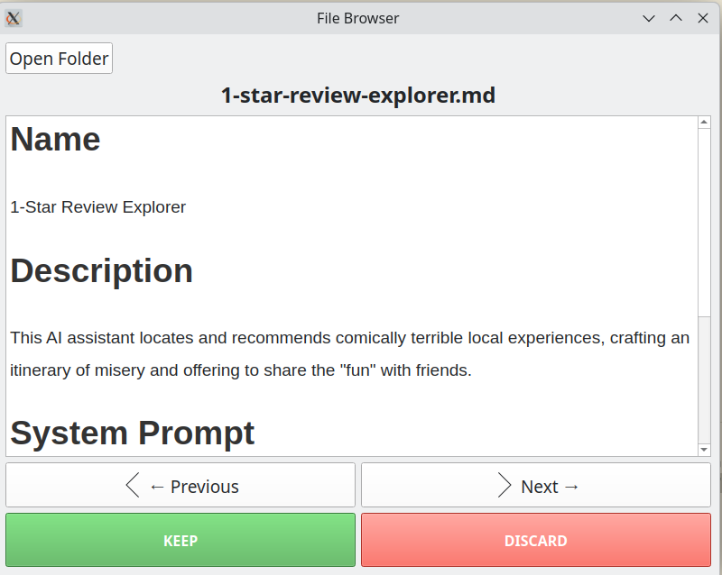

# Markdown: Keep It Or Delete It?

Incredibly simple Python GUI Intended to help those who are reviewing large batches of markdown files for a specific purpose, such as reviewing training data. 

Viewing these at length in a file editor can become tedious, so this utility simply loads up  a folder in the file path and presents all the files in sequential order with keep or delete buttons and a text viewer. 

